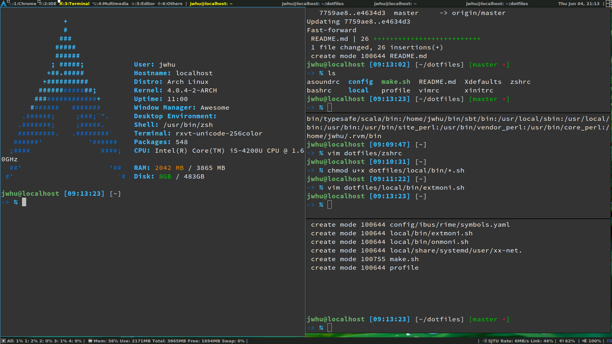

# dotfiles

## Usage

run with
    
    cd
    git clone https://github.com/wuciawe/dotfiles.git
    cd dotfiles
    ./make.sh

awesome wm, support
*   `PrtSc` to select block of screen and save to `~/Pictures/screenshots/`
*   volume control with `XF86AudioRaiseVolume`, `XF86AudioLowerVolume` and `XF86AudioMute`
*   brightness control with `XF86MonBrightnessDown` and `XF86MonBrightnessUp`

set `zsh` default with

    chsh -s $(which zsh)
    
Switch on single monitor with

    onmoni.sh pri    # for the primary monitor
    onmoni.sh a      # for the extended monitor, a any string not equal to pri
    
Swith on both the primary monitor and the extended monitor with

    extonmoni.sh

## Screenshot

